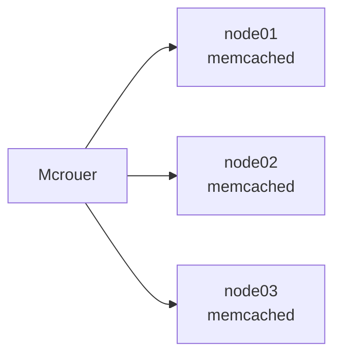
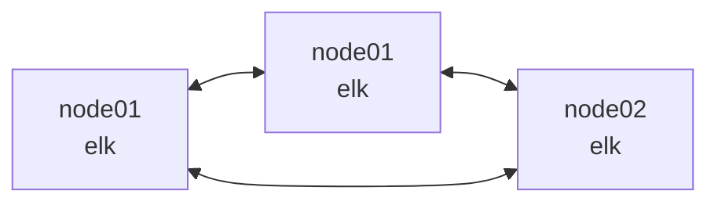
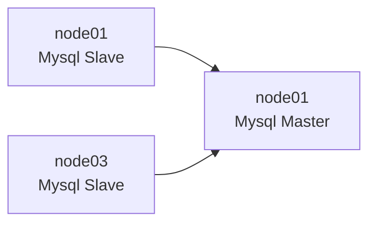

# DevOps onboarding

*In this document will present the DevOps onboarding task*
These are states file created for the automated installation of some software for onboarding tasks:

* Redis  
* Nginx and PHP
* Memcached and MCrouter
* Elasticsearch
* MySQL

in this installation, Saltstack has been used as configuration management. The base of all nodes is the Debian stretch
Nspawn has been used as a container-based deployment.

## Deployment plan

   Nspawn base container created throw bootstrap form Debian stretch. for each deployment, make a copy of the base container and rename it to a new container after that salt-minion has been configured and the key has been accepted throw the salt orchestration module. for better configuration and less code duplication, all face of the creation container and configuration has been merged in these states.

* accept_key
* active_saltminion
* create_container
* install_nspawn.

## pillars

Pillars have been used for set variables and some dynamic configurations on salt-master to use in orchestrations and states. for each app created its pillars to set application version and configuration. in the nodes_defenation file, configure the placement of application servers. if we need to change the pillars we had to run this command to update the pillars

```  bash
salt '*' saltutil.refresh_pillar
```

## Redis installation

Redis deployment is a master-slave-based deployment. there is another kind of deployment that has been used but master-slave-based is selected for this deployment. three Redis server has been installed two of them is a slave and synced with the master. cause of trouble with bridge server nat and Redis Sentinel we had to use hosed mode in Nspawn networking. for the dynamicity of adding a new node to the cluster, a python script has been created to check which server is master and put the IP address of the server in the new node configuration.
for check and master selection three sentinel nodes have been installed in the cluster.

```mermaid
  flowchart LR;
  A[node02\nredis-master] --> B[node01\nredis-master]
  C[node03\nredis-slave] --> B
  D((node01\nsentinel)) --> B
  E((node02\nsentinel)) --> C
  F((node03\nsentinel)) --> A
  D <--> E
  F <--> E
  D <--> E
   ```

### Install node redis

For salt orchestration.

``` bash
salt-run state.orchestrate install_redis
```

This is a sample for three node cluster installation without salt orchestration.

``` bash
salt 'Nnode01' state.sls  sls_files/install_nspawn 
salt 'Nnode01' state.sls  sls_files/create_container pillar='{"nodename":"Nnode01-redis"}'
salt 'Nnode01' state.sls  sls_files/active_saltminion pillar='{"nodename":"Nnode01-redis"}'
salt 'master' state.sls  sls_files/accept_key pillar='{"nodename":"Nnode01-redis"}'
salt 'Nnode01' state.sls  sls_files/install_redis pillar='{"nodename":"Nnode01-redis"}'

salt 'Nnode02' state.sls  sls_files/install_nspawn 
salt 'Nnode02' state.sls  sls_files/create_container pillar='{"nodename":"Nnode02-redis"}'
salt 'Nnode02' state.sls  sls_files/active_saltminion pillar='{"nodename":"Nnode02-redis"}'
salt 'master' state.sls  sls_files/accept_key pillar='{"nodename":"Nnode02-redis"}'
salt 'Nnode02' state.sls  sls_files/install_redis pillar='{"nodename":"Nnode02-redis"}'

salt 'Nnode03' state.sls  sls_files/install_nspawn 
salt 'Nnode03' state.sls  sls_files/create_container pillar='{"nodename":"Nnode03-redis"}'
salt 'Nnode03' state.sls  sls_files/active_saltminion pillar='{"nodename":"Nnode03-redis"}'
salt 'master' state.sls  sls_files/accept_key pillar='{"nodename":"Nnode03-redis"}'
salt 'Nnode03' state.sls  sls_files/install_redis pillar='{"nodename":"Nnode03-redis"}'
```

### Remove Node redis

For salt orchestration.

``` bash
salt-run state.orchestrate remove_redis pillar='{"nodename": "Nnode04"}'
```

Example of remove Node04-redis from cluster with four nodes:

``` bash
salt 'Nnode04' state.sls  sls_files/remove_container pillar='{"nodename":"Nnode04-redis"}'
salt 'master' state.sls  sls_files/deactivate_minion pillar='{"nodename":"Nnode04-redis"}'
```

## Nginx and PHP

For this part, Nginx, PHP, and PHP-fpm have been installed on one Nspawn container. simple PHP code has been deployed to show the PHP version on the server. in this deployment, a bridge network has been used for deployments.  

### Install node web

For salt orchestration.

``` bash
salt-run state.orchestrate install_web
```

This is a sample for three node cluster installation without salt orchestration.

``` bash
salt 'Nnode04' state.sls  sls_files/install_nspawn 
salt 'Nnode04' state.sls  sls_files/create_container pillar='{"nodename":"Nnode04-web"}'
salt 'Nnode04' state.sls  sls_files/active_saltminion pillar='{"nodename":"Nnode04-web"}'
salt 'master' state.sls  sls_files/accept_key pillar='{"nodename":"Nnode04-web"}'
salt 'Nnode04' state.sls  sls_files/install_web pillar='{"nodename":"Nnode04-web"}'
```

### Remove Node web

For salt orchestration.

``` bash
salt-run state.orchestrate remove_web pillar='{"nodename": "Nnode04"}'
```

Example of remove Node04-web from cluster with four nodes:

``` bash
salt 'Nnode04' state.sls  sls_files/remove_container pillar='{"nodename":"Nnode04-web"}'
salt 'master' state.sls  sls_files/deactivate_minion pillar='{"nodename":"Nnode04-web"}'
```

## Memcached and mcrouter

Memcached and Mcrouter have been installed on separated Nspawns. this cluster has been created for cache requests. for this installation, Mcrouter 0.38.0 has been compiled on the Debian server and the deb package has been created for this deployment.

* After some investigation finds out Mcrouter has dozen of the new version that has been released during these years. now Mcrouter does not use semantic versioning. version 0.38.0 released in 2019



### this is a simple configuration of Mcrouter

``` bash
{
  "pools": {
    "A": {
      "servers": [
"192.168.160.11:11211","192.168.160.12:11211","192.168.160.13:11211" 
      ]
    }
  },
  "route": {
    "type": "OperationSelectorRoute",
    "operation_policies": {
      "add": "AllSyncRoute|Pool|A",
      "delete": "AllSyncRoute|Pool|A",
      "get": "FailoverRoute|Pool|A",
      "set": "AllSyncRoute|Pool|A"
    }
  }
}
```

### Install node mcrouter

For salt orchestration.

``` bash
salt-run state.orchestrate install_mcrouter
```

This is a sample for three node cluster installation without salt orchestration.

``` bash
salt 'Nnode04' state.sls  sls_files/install_nspawn 
salt 'Nnode04' state.sls  sls_files/create_container pillar='{"nodename":"Nnode04-mcrouter"}'
salt 'Nnode04' state.sls  sls_files/active_saltminion pillar='{"nodename":"Nnode04-mcrouter"}'
salt 'master' state.sls  sls_files/accept_key pillar='{"nodename":"Nnode04-mcrouter"}'
salt 'Nnode04' state.sls  sls_files/install_mcrouter pillar='{"nodename":"Nnode04-mcrouter"}'
```

### Remove Node mcrouter

For salt orchestration.

``` bash
salt-run state.orchestrate remove_mcrouter pillar='{"nodename": "Nnode04"}'
```

Example of remove Node04-mcrouter from cluster with four nodes:

``` bash
salt 'Nnode04' state.sls  sls_files/remove_container pillar='{"nodename":"Nnode04-mcrouter"}'
salt 'master' state.sls  sls_files/deactivate_minion pillar='{"nodename":"Nnode04-mcrouter"}'
```

### Install node memcache

For salt orchestration.

``` bash
salt-run state.orchestrate install_memcache
```

This is a sample for three node cluster installation without salt orchestration.

``` bash
salt 'Nnode01' state.sls  sls_files/install_nspawn 
salt 'Nnode01' state.sls  sls_files/create_container pillar='{"nodename":"Nnode01-memcache"}'
salt 'Nnode01' state.sls  sls_files/active_saltminion pillar='{"nodename":"Nnode01-memcache"}'
salt 'master' state.sls  sls_files/accept_key pillar='{"nodename":"Nnode01-memcache"}'
salt 'Nnode01' state.sls  sls_files/install_memcache pillar='{"nodename":"Nnode01-memcache"}'

salt 'Nnode02' state.sls  sls_files/install_nspawn 
salt 'Nnode02' state.sls  sls_files/create_container pillar='{"nodename":"Nnode02-memcache"}'
salt 'Nnode02' state.sls  sls_files/active_saltminion pillar='{"nodename":"Nnode02-memcache"}'
salt 'master' state.sls  sls_files/accept_key pillar='{"nodename":"Nnode02-memcache"}'
salt 'Nnode02' state.sls  sls_files/install_memcache pillar='{"nodename":"Nnode02-memcache"}'

salt 'Nnode03' state.sls  sls_files/install_nspawn 
salt 'Nnode03' state.sls  sls_files/create_container pillar='{"nodename":"Nnode03-memcache"}'
salt 'Nnode03' state.sls  sls_files/active_saltminion pillar='{"nodename":"Nnode03-memcache"}'
salt 'master' state.sls  sls_files/accept_key pillar='{"nodename":"Nnode03-memcache"}'
salt 'Nnode03' state.sls  sls_files/install_memcache pillar='{"nodename":"Nnode03-memcache"}'
```

### Remove Node memcache

For salt orchestration.

``` bash
salt-run state.orchestrate remove_memcache pillar='{"nodename": "Nnode04"}'
```

Example of remove Node04-memcache from cluster with four nodes:

``` bash
salt 'Nnode04' state.sls  sls_files/remove_container pillar='{"nodename":"Nnode04-memcache"}'
salt 'master' state.sls  sls_files/deactivate_minion pillar='{"nodename":"Nnode04-memcache"}'
salt 'Nnode02-mcrouter' state.sls  sls_files/install_mcrouter
```

## Elasticsearch

three-node cluster with a basic configuration has been installed. for this deployment, vm.max_map_count has to update in sysctl to start service. elasticsearch nodes have 512Mb of ram.



### Install node Elasticsearch

For salt orchestration.

``` bash
salt-run state.orchestrate install_elk
```

This is a sample for three node cluster installation without salt orchestration.

``` bash
salt 'Nnode01' state.sls  sls_files/install_nspawn 
salt 'Nnode01' state.sls  sls_files/create_container pillar='{"nodename":"Nnode01-elk"}'
salt 'Nnode01' state.sls  sls_files/active_saltminion pillar='{"nodename":"Nnode01-elk"}'
salt 'master' state.sls  sls_files/accept_key pillar='{"nodename":"Nnode01-elk"}'
salt 'Nnode01' state.sls  sls_files/install_elk pillar='{"nodename":"Nnode01-elk"}'

salt 'Nnode02' state.sls  sls_files/install_nspawn 
salt 'Nnode02' state.sls  sls_files/create_container pillar='{"nodename":"Nnode02-elk"}'
salt 'Nnode02' state.sls  sls_files/active_saltminion pillar='{"nodename":"Nnode02-elk"}'
salt 'master' state.sls  sls_files/accept_key pillar='{"nodename":"Nnode02-elk"}'
salt 'Nnode02' state.sls  sls_files/install_elk pillar='{"nodename":"Nnode02-elk"}'

salt 'Nnode03' state.sls  sls_files/install_nspawn 
salt 'Nnode03' state.sls  sls_files/create_container pillar='{"nodename":"Nnode03-elk"}'
salt 'Nnode03' state.sls  sls_files/active_saltminion pillar='{"nodename":"Nnode03-elk"}'
salt 'master' state.sls  sls_files/accept_key pillar='{"nodename":"Nnode03-elk"}'
salt 'Nnode03' state.sls  sls_files/install_elk pillar='{"nodename":"Nnode03-elk"}'
```

### Remove Node Elasticsearch

For salt orchestration.

``` bash
salt-run state.orchestrate remove_elk pillar='{"nodename": "Nnode04"}'
```

Example of remove Node04-elk from cluster with four nodes:

``` bash
salt 'Nnode04' state.sls  sls_files/remove_container pillar='{"nodename":"Nnode04-elk"}'
salt 'master' state.sls  sls_files/deactivate_minion pillar='{"nodename":"Nnode04-elk"}'
salt 'Nnode01-elk' state.sls  sls_files/install_elk
salt 'Nnode02-elk' state.sls  sls_files/install_elk
salt 'Nnode03-elk' state.sls  sls_files/install_elk
```

## MySQL

For this deployment, we use MySQL Percona XtraDB, master-slave deployments. all installation phases have been using salt stack states. for offline installation, all deb packages have been downloaded and used in states. states have been arranged to add more nodes without any further configuration.



### Install node Mysql

For salt orchestration.

``` bash
salt-run state.orchestrate install_mysql
```

This is a sample for three node cluster installation without salt orchestration.

``` bash
salt 'Nnode01' state.sls  sls_files/install_nspawn 
salt 'Nnode01' state.sls  sls_files/create_container pillar='{"nodename":"Nnode01-mysql"}'
salt 'Nnode01' state.sls  sls_files/active_saltminion pillar='{"nodename":"Nnode01-mysql"}'
salt 'master' state.sls  sls_files/accept_key pillar='{"nodename":"Nnode01-mysql"}'
salt 'Nnode01' state.sls  sls_files/install_mysql pillar='{"nodename":"Nnode01-mysql"}'

salt 'Nnode02' state.sls  sls_files/install_nspawn 
salt 'Nnode02' state.sls  sls_files/create_container pillar='{"nodename":"Nnode02-mysql"}'
salt 'Nnode02' state.sls  sls_files/active_saltminion pillar='{"nodename":"Nnode02-mysql"}'
salt 'master' state.sls  sls_files/accept_key pillar='{"nodename":"Nnode02-mysql"}'
salt 'Nnode02' state.sls  sls_files/install_mysql pillar='{"nodename":"Nnode02-mysql"}'

salt 'Nnode03' state.sls  sls_files/install_nspawn 
salt 'Nnode03' state.sls  sls_files/create_container pillar='{"nodename":"Nnode03-mysql"}'
salt 'Nnode03' state.sls  sls_files/active_saltminion pillar='{"nodename":"Nnode03-mysql"}'
salt 'master' state.sls  sls_files/accept_key pillar='{"nodename":"Nnode03-mysql"}'
salt 'Nnode03' state.sls  sls_files/install_mysql pillar='{"nodename":"Nnode03-mysql"}'
```

### Remove Node Mysql

For salt orchestration.

``` bash
salt-run state.orchestrate remove_mysql pillar='{"nodename": "Nnode04"}'
```

Example of remove Node04-mysql from cluster with four nodes:

``` bash
salt 'Nnode04' state.sls  sls_files/remove_container pillar='{"nodename":"Nnode04-mysql"}'
salt 'master' state.sls  sls_files/deactivate_minion pillar='{"nodename":"Nnode04-mysql"}'
salt 'Nnode01-mysql' state.sls  sls_files/install_mysql
salt 'Nnode02-mysql' state.sls  sls_files/install_mysql
salt 'Nnode03-mysql' state.sls  sls_files/install_mysql
```
